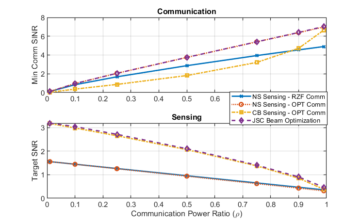
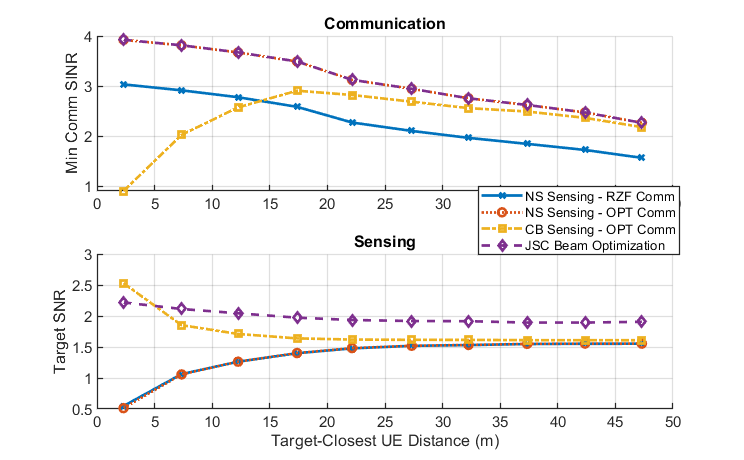

## Cell-Free ISAC MIMO Systems: Joint Sensing and Communication Beamforming

The implementation for the simulations of the paper "[Cell-Free ISAC MIMO Systems: Joint Sensing and Communication Beamforming](https://arxiv.org/abs/2301.11328)".

### Reproducing the Results

* The simulation parameters can be set in `sim_params.m` file.

* Set the CVX path in the first line of `run.m` and run the script to generate the simulation results. 

(This step may be skipped since the output data files are pre-generated and already available. If skipped, add the subfolders to the MATLAB path before the next steps. )

* Run `plots/plot_results_power.m` to regenerate Figure 3 (power ratio vs performance) of the paper.

* Run `plots/plot_results_dist.m` to regenerate Figure 4 (min. distance vs performance) of the paper.

### Abstract

*This paper considers a cell-free integrated sensing and communication (ISAC) MIMO system, where distributed MIMO access points are jointly serving the communication users and sensing the targets. For this setup, we first develop two baseline approaches that separately design the sensing and communication beamforming vectors, namely communicationprioritized sensing beamforming and sensing-prioritized communication beamforming. Then, we consider the joint sensing and communication (JSC) beamforming design and derive the optimal structure of these JSC beamforming vectors based on a max-min fairness formulation. The results show that the developed JSC beamforming is capable of achieving nearly the same communication signal-to-interference-plus-noise ratio (SINR) that of the communication-prioritized sensing beamforming solutions with almost the same sensing SNR of the sensingprioritized communication beamforming approaches, yielding a promising strategy for cell-free ISAC MIMO systems.*

### License

 This code package is licensed under a [Creative Commons Attribution-NonCommercial-ShareAlike 4.0 International License](https://creativecommons.org/licenses/by-nc-sa/4.0/). 

If you in any way use this code for research that results in publications, please cite our original article:

> U. Demirhan and A. Alkhateeb, "Cell-free ISAC MIMO systems: Joint sensing and communication beamforming." arXiv preprint arXiv:2301.11328, 2023.
